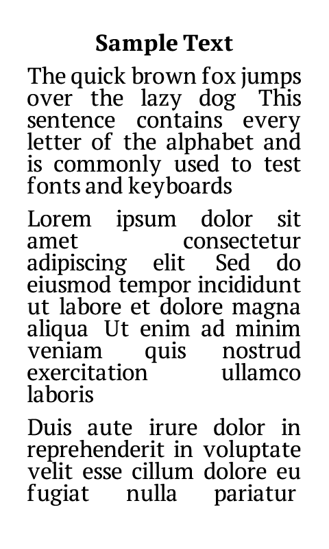
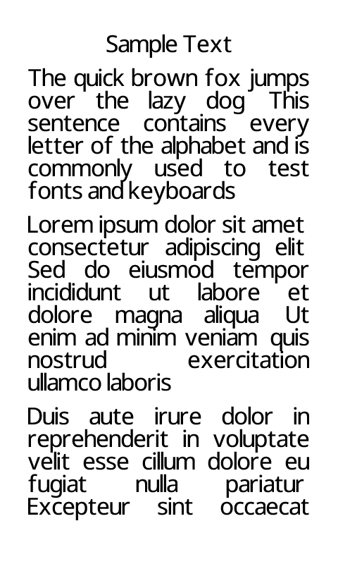

# Fonts

Papyrix Reader supports custom fonts for reading. Fonts are converted to a proprietary `.epdfont` format that is made for e-paper displays.

## How Fonts Work

### Streaming Font System

Custom fonts use a streaming system that uses little memory. The system loads glyph bitmaps from the SD card when they are necessary. It does not keep the full font in RAM. This saves approximately **50KB of RAM for each font**.

- **Glyph metadata** (character metrics, positions) is loaded into RAM
- **Glyph bitmaps** (the pixels) come from SD when they are necessary
- An **LRU cache** keeps glyphs that were used recently in memory for fast access
- Usual RAM use: approximately 25KB for each font (compared to approximately 70KB for fonts that are fully loaded)

The user does not see this difference. Fonts operate the same way. They only use less memory.

### Supported Styles

Custom `.epdfont` fonts support **regular** and **bold** styles:

- **Regular** (`regular.epdfont`) - Required. Loaded when the book is opened.
- **Bold** (`bold.epdfont`) - Optional. Loaded when bold text occurs the first time. This saves approximately 42KB of RAM for books that do not use bold.
- **Italic** text uses the regular variant. When you use built-in fonts, the native italic is used.

### Fallback Behavior

Papyrix makes sure that you can always read your books, even if a custom font fails:

1. **Font load failure** → The built-in font is used
2. **Individual glyph failure** → The character is skipped (no crash)
3. **SD card read error** → Affected characters are skipped. Reading continues.

If you see missing characters, try a different font in Settings. The built-in font is always available as a reliable fallback.

### Built-in Font Coverage

The built-in fonts include native support for:

- **Latin** - Western European languages and Eastern European languages, including Vietnamese diacritics
- **Cyrillic** - Russian, Ukrainian, and other languages that use Cyrillic script
- **Thai** - Full Thai script with correct mark positions
- **Greek** - Modern Greek alphabet
- **Arabic** - Arabic script with contextual shaping and RTL layout

You do not need custom fonts for these scripts. They operate immediately.

### Filename display coverage

The device file browser uses the built-in UI font. Web-created filenames are supported for Latin (including Vietnamese), Cyrillic, Greek, Thai, and Arabic. CJK `.bin` fonts are available for book text only. They are not used in UI rendering. Web UI create, upload, and rename operations reject CJK filenames.

## Font Samples

### PT Serif

A serif typeface that you can use for many texts. Good for body text. Good readability on e-paper displays.

- **Styles**: Regular, Bold
- **License**: OFL (Open Font License)



### Bookerly

Amazon custom font made for e-readers. Made for readability on low-resolution displays.

- **Styles**: Regular, Bold, Italic
- **License**: Proprietary (Amazon)


### Literata

A contemporary serif typeface made for long-form reading. Good legibility.

- **Styles**: Regular, Bold, Italic
- **License**: OFL (Open Font License)


### Noto Serif

A serif font from the Google Noto family. Good readability with support for many languages.

- **Styles**: Regular
- **License**: OFL (Open Font License)


### Noto Sans

A sans-serif font from the Google Noto family. Modern appearance with support for many languages.

- **Styles**: Regular, Italic (Variable font)
- **License**: OFL (Open Font License)



### Roboto

Google signature font family. Clean, modern design. Good for UI and reading.

- **Styles**: Regular, Italic (Variable font)
- **License**: Apache 2.0


### Ubuntu

The Ubuntu font family has a contemporary style. It is made for screen reading.

- **Styles**: Regular, Bold, Italic
- **License**: Ubuntu Font License


### OpenDyslexic

A typeface made to increase readability for readers with dyslexia. Weighted bottoms prevent letter rotation.

- **Styles**: Regular, Bold, Italic
- **License**: OFL (Open Font License)


### Noto Sans Arabic

A sans-serif font with full Arabic script support, including contextual shaping and ligatures.

- **Styles**: Regular, Bold
- **Theme**: `light-arabic.theme`
- **License**: OFL (Open Font License)

### IBM Plex Sans Arabic

IBM Arabic typeface from the Plex family. A modern sans-serif design with good Arabic presentation forms coverage (140/144 in Forms-B). This makes it compatible with the Papyrix Arabic shaper. It gives a good reading result for Arabic content.

- **Styles**: Regular, Bold
- **Theme**: `light-ibm-plex-arabic.theme`
- **License**: OFL (Open Font License)

### CJK Fonts (Chinese/Japanese/Korean)

For CJK texts, Papyrix uses external `.bin` format fonts. These fonts stream from the SD card because they are large. The `.bin` format uses direct codepoint indexing (1-bit bitmap, MSB first) for the full BMP range (U+0000-U+FFEF).

> **Note:** CJK fonts are supported for book text (reading view) only. UI elements (home screen, status bar, book title overlay) use built-in bitmap fonts that do not include CJK glyphs.

#### Quick Start with gen_cjk_theme.sh

The easiest method to make CJK fonts is `gen_cjk_theme.sh`. It makes a `.bin` font and a matching `.theme` file. The script downloads the `fontconvert-bin` binary if it is not built locally (no Go installation is necessary):

```bash
# CJK font renders everything (Latin + CJK)
./scripts/gen_cjk_theme.sh --cjk MyCJKFont.otf --latin-mode cjk --name my-cjk-font

# Separate Latin font for ANSI, CJK font for ideographs
./scripts/gen_cjk_theme.sh --cjk MyCJKFont.ttf --latin MySerifFont.ttf --name my-mixed-font

# CJK only, builtin system font handles Latin
./scripts/gen_cjk_theme.sh --cjk MyCJKFont.otf --latin-mode system --name my-cjk-font
```

#### Manual Conversion with fontconvert-bin

For one-size conversion or custom options, use the Go converter:

```bash
# Build from source (requires Go) — one-time
make fontconvert-bin

# Or let gen_cjk_theme.sh auto-download the pre-built binary (no Go needed)

# Basic CJK conversion
tools/fontconvert-bin/build/fontconvert-bin MyCJKFont.ttf --pixel-height 34 --name my-cjk -o /tmp/

# With separate Latin font
tools/fontconvert-bin/build/fontconvert-bin MyCJKFont.ttf --pixel-height 34 --latin-font Latin.ttf --name mixed -o /tmp/

# CJK only (builtin handles Latin)
tools/fontconvert-bin/build/fontconvert-bin MyCJKFont.ttf --pixel-height 30 --cjk-only --name cjk -o /tmp/
```

Options:
- `--size N` — Font size in points (default: 20)
- `--pixel-height N` — Pixel height (overrides --size/--dpi)
- `--name NAME` — Font name for output
- `--latin-font FILE` — Separate font for Latin (U+0000-U+024F)
- `--latin-size N` — Pixel height for Latin font
- `--cjk-only` — Zero Latin range, empty slots fall through to builtin
- `-o DIR` — Output directory
- `--dpi N` — Rendering DPI (default: 150)
- `--max-codepoint N` — Highest codepoint (default: 0xFFEF)

#### CJK Font Format Details

- **Direct codepoint indexing**: `offset = codepoint * bytesPerChar`
- **1-bit bitmap**, MSB first, `bytesPerRow = (W+7)//8`
- **Cell dimensions**: calculated from sample CJK characters, maximum 64x64
- **Cell size constraint**: maximum 512 bytes/glyph (64x64 at 1-bit)
- **Filename encodes metadata**: `{name}_{size}_{W}x{H}.bin` or `{name}_px{height}_{W}x{H}.bin`
- **Glyph filtering**: finds Latin glyph reuse (font mapping defects), skips narrow ideographs (less than 20% cell width)

#### Latin Handling Modes

| Mode | Description | When to use |
|------|-------------|-------------|
| `cjk` | CJK font shows Latin + CJK | Font has good Latin glyphs |
| `include` | Separate Latin font for U+0000-U+024F | You want different Latin/CJK fonts |
| `system` | Builtin font handles Latin, `.bin` for CJK only | You want builtin Latin rendering |

## Converting and Installing Fonts

See the [Customization Guide](customization.md#custom-fonts) for the full procedure to convert TTF/OTF fonts to `.epdfont` format and install them on your device.

## Font Sources

- [Google Fonts](https://fonts.google.com/) - Free, open-source fonts
- [Noto Fonts](https://fonts.google.com/noto) - Support for many languages
