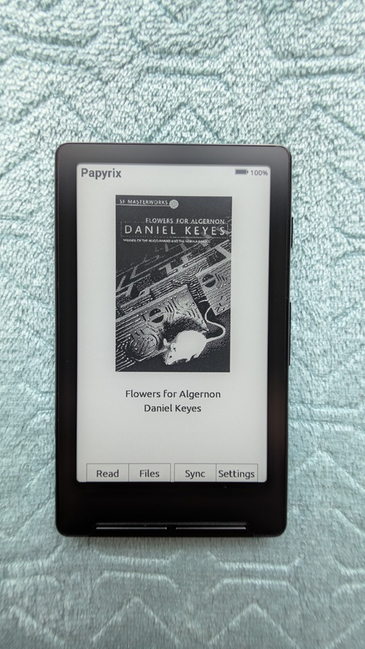
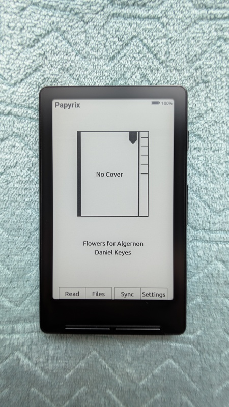
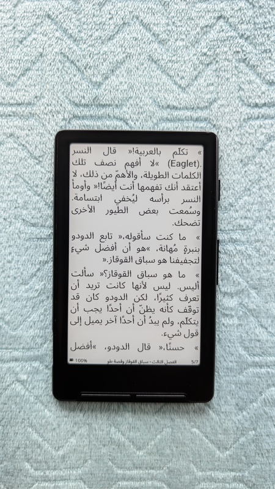
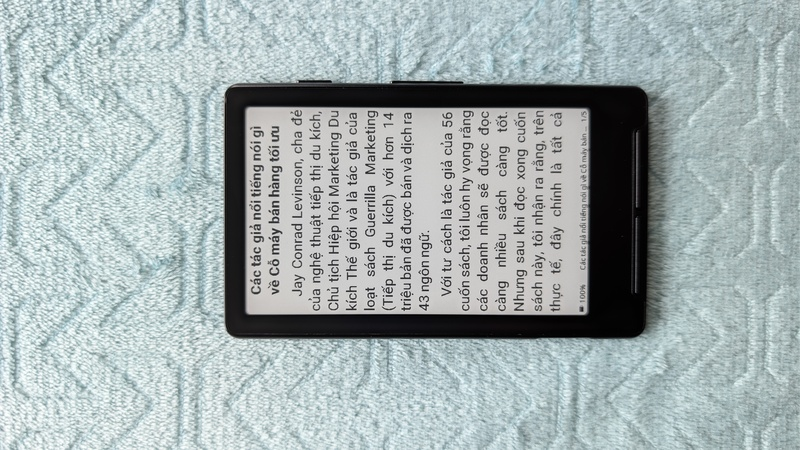
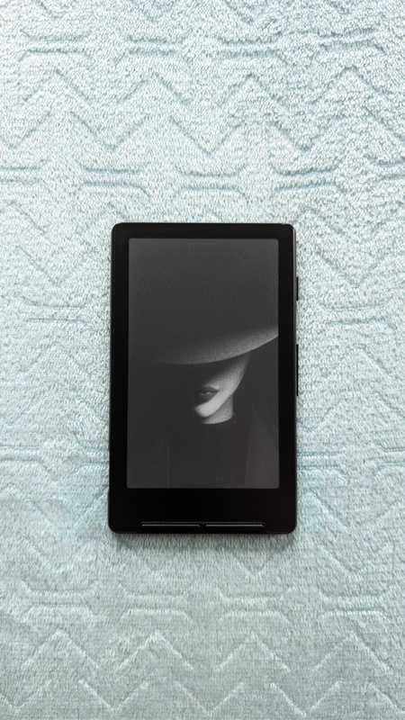
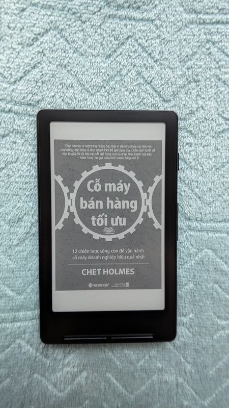
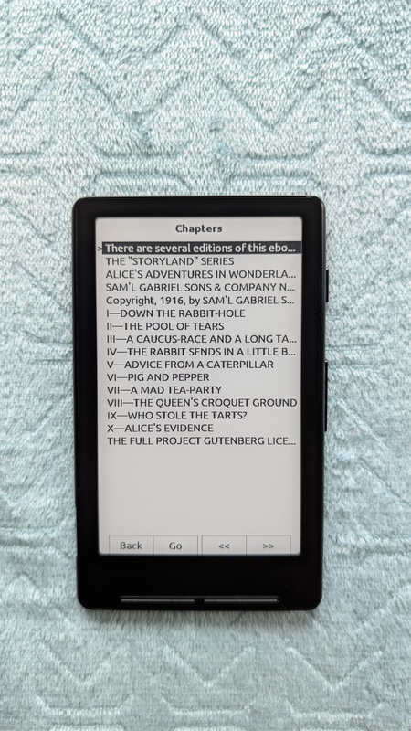
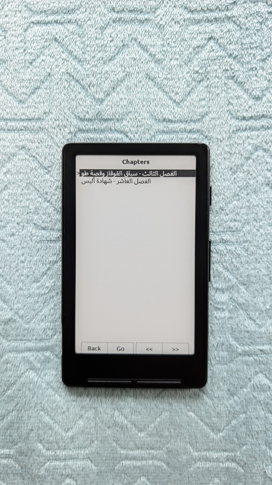

# Papyrix User Guide

This guide describes the hardware controls, navigation, and reading features of the **Papyrix** firmware.

## 1. Hardware Overview

The device uses the standard buttons on the Xteink X4 / X3 in the same layout:

### Button Layout

- **Bottom Edge:** Back, Confirm, Left, Right
- **Right Side:** Power, Volume Up, Volume Down

---

## 2. Power & Startup

### Power On / Off

To start or stop the device, **press and hold the Power button for half a second**. In **Settings** you can set the power button to start on a short press, not a long press.

### First Launch

When you start the device the first time, you see the **Home** screen.

> **Note:** On later restarts, the firmware opens the last book that you read (you can set this with **Startup Behavior** in Settings).

---

## 3. Screens

### 3.1 Home Screen

With cover:



Without cover:



Empty:


The Home Screen shows the title "Papyrix" at the top with a **battery indicator** in the top-right corner.

#### Book Display
The center of the screen shows the cover of the book that is open. The book title and author are below it.
- **No book open:** Shows "No book open"

#### Bottom Bar
Four buttons at the bottom of the screen:
- **Read** — Continue reading the current book
- **Books** — Open the Books screen (books that you opened before, with access to the file browser)
- **Apps** — Launcher for file transfer (WiFi/Calibre sync) and other apps
- **Settings** — Device settings

**Navigation:**
* Use **Left/Right** or **Volume Up/Down** to move between buttons
* Press **Confirm** to select

### 3.2 Books (Recent) & File Selection

From the Home screen, press **Books** to open the Books screen.

#### Books (Recent)

The Books screen keeps a maximum of ten books that you opened before. It shows as many as fit on one screen. It orders them with the most recent first. Each row shows the title and author plus reading progress and collected reading time when this data is available.

- **Back:** Go back to the Home screen.
- **Open / Confirm:** Continue the selected book at its saved reading position.
- **Files / Left:** Open the file browser (below).
- **Info / Right:** Open Book Stats for the selected book. This shows Progress, Time read, and Sessions.
- Missing files are removed from the list. There is no Remove action for each book.
- After you read a book that you opened from here, you go back to the Books screen.

#### File Browser


The Files screen is a folder and file browser.

* **Navigate List:** Use **Left** (or **Volume Up**), or **Right** (or **Volume Down**) to move the selection cursor up
  and down through folders and books.
* **Open Selection:** Press **Confirm** to open a folder or read a selected book.
* **Delete Item:** Press **Right** on an item and confirm the action. Folders are always deleted permanently with all their contents. Files move to the recycle bin (`/trash`) by default. Set **Recycle bin** to off in **Settings → Device** to delete files permanently.

> **Note:** The recycle bin is a regular folder named `trash` at the root of the SD card. It copies the initial folder structure of trashed books. Open its folders and press **Confirm** on a book to put it back in its initial folder (or the root if that folder cannot be created again). Press **Right** to delete it permanently. You cannot delete the `trash` folder from the file browser. Use **Empty Trash** in the Cleanup menu to clear it.

> **Note:** EPUB (.epub), FB2 (.fb2), HTML (.html, .htm), XTC (.xtc, .xtch), Markdown (.md, .markdown), and plain text (.txt, .text) file formats are supported. EPUB 2 and EPUB 3 formats are fully supported. FB2 files support metadata, TOC navigation, and text formatting (no inline images). HTML files show as standalone documents with formatting. Markdown files show with basic formatting (headers, bold, italic, lists). The device supports SD cards with FAT32 format and exFAT format.

> **Tip:** The Web UI supports folder names and file names in Latin (including Vietnamese), Cyrillic, Greek, Thai, and Arabic. Names have a limit of 255 UTF-8 bytes. Full paths have a limit of 1023 bytes. CJK filenames are not supported in the device file browser. For deep folder trees with supported non-Latin names, use exFAT. Make a backup of the SD card before you format it again.

> **Note:** These folders are hidden from the file browser:
> - `System Volume Information`, `LOST.DIR`, `$RECYCLE.BIN` — OS system folders
> - `config` — Papyrix configuration files
> - `XTCache` — XTC format cache
> - `sleep` — Custom sleep screen images
> - `.papyrix` — Internal cache (dot-prefix hidden by default)

> **Note:** Each folder can show a maximum of 1000 items. Put large libraries into subfolders if you go above this limit.

> **Note:** You cannot delete the book that is open. Close the book first, then delete it.

### 3.3 Reading Screen

Test:


Images:


Arabic (RTL):



Landscape:



See [4. Reading Mode](#4-reading-mode) below for more data.

### 3.4 File Transfer (Sync)

You get file transfer from the Home screen. Open **Apps** and select **File Transfer**. This lets you upload new e-books to the device through WiFi or connect to Calibre.

When you go into the screen, the device asks you to select a network mode:

* **Join Network:** Connect to a WiFi network that is there. You see a list of available networks. You can enter passwords when necessary. Networks that you saved before connect automatically.
* **Create Hotspot:** The device makes its own WiFi network. You can connect to it from your computer or phone.


After the connection, your X4 starts a web server. See the [webserver docs](webserver.md) for
how to connect and upload files.

> **Note:** When you exit File Transfer, the device restarts to get memory back that WiFi used.

### 3.5 Settings


The Settings screen has five categories:

#### Reader

Reading and display settings:

- **Theme** (default: light)
  - Select from available themes (light, dark, or custom themes from the SD card)
  - Themes control colors, layout, and fonts
  - See [Customization Guide](customization.md) to make custom themes

- **Font Size** (default: Small)
  - Options: XSmall (12pt), Small (14pt), Normal (16pt), Large (18pt)
  - Text size for reading

- **Text Layout** (default: Standard)
  - Options: Compact, Standard, Large
  - Controls first-line indent and paragraph spacing:
    - **Compact:** No indent, no extra spacing (dense text)
    - **Standard:** Usual indent (em-space), small spacing between paragraphs
    - **Large:** Large indent, full line spacing between paragraphs

- **Line Spacing** (default: Normal)
  - Options: Compact, Normal, Relaxed, Large
  - Controls vertical spacing between lines in paragraphs:
    - **Compact:** Tighter line spacing (0.85×)
    - **Normal:** Standard line spacing (0.95×)
    - **Relaxed:** More space between lines (1.10×)
    - **Large:** Maximum line spacing (1.20×)
  - A change of line spacing can increase readability for different fonts and preferences

- **Text Anti-Aliasing** (default: OFF)
  - Set grayscale text rendering to on for smoother font edges
  - Operates with builtin fonts and custom fonts converted with `--2bit`
  - Set to off for faster page turns and to remove the short "thick text" flash during transitions

- **Paragraph Alignment** (default: Justified)
  - Options: Justified, Left, Center, Right
  - Text alignment for paragraphs (headers stay centered)

- **Hyphenation** (default: ON)
  - Break long words at soft hyphen positions in EPUB content
  - Words that are too wide for the line are split with character-level hyphenation
  - Decreases large gaps in justified text and prevents words from going past the line

- **Show Images** (default: ON)
  - Show inline images in EPUB content and book covers
  - Set to off for faster page rendering (images show an "[Image]" placeholder)

- **Status Bar** (default: Full)
  - Options: None, No Progress, Full
  - Controls the reading screen status bar display
  - **Full:** Shows battery, book title, and page number (for example, "5 / 12")
  - **No Progress:** Shows battery and book title only
  - **None:** Hides the status bar fully for maximum reading area
  - **Note:** The total page count for a chapter shows only after the chapter is fully cached. While you read a chapter the first time, only the current page number is shown until all pages are rendered. Overall book completion percentage is not available because of memory limits on the device.

- **Reading Orientation** (default: Portrait)
  - Options: Portrait, Landscape CW, Inverted, Landscape CCW
  - Screen orientation for reading

- **Full Book Process** (default: OFF)
  - When this is on, the device indexes all pages of the book before you start reading
  - Shows a progress bar during indexing. Press **Back** to cancel and go back to the file list
  - After indexing, the exact total page count is immediately available in the status bar
  - Useful for books where you want accurate page counts from the start (skipped for XTC/XTCH files)
  - Sections that are already cached are skipped, so a book that you indexed before opens immediately

#### Device

Power and device behavior settings:

- **Auto Sleep Timeout** (default: 10 min)
  - Options: 5 min, 10 min, 15 min, 30 min, Never
  - Time with no activity before the device sleeps

- **Sleep Screen** (default: Dark)
  - Options: Dark, Light, Custom, Cover, Keep Page
  - Which image to show when the device sleeps

- **Startup Behavior** (default: Last Document)
  - Options: Last Document, Home
  - **Last Document:** Continue the last opened book on start
  - **Home:** Always start at the Home screen

- **Short Power Button** (default: Ignore)
  - Options: Ignore, Sleep, Page Turn, Bookmark
  - **Ignore:** Short press does nothing (long press for sleep)
  - **Sleep:** Short press puts the device to sleep
  - **Page Turn:** Short press goes to the next page while you read (useful for one-handed reading)
  - **Bookmark:** Short press bookmarks the current page while you read (shows a short notification)

- **Pages Per Refresh** (default: 15)
  - Options: 1, 5, 10, 15, 30
  - Number of pages to turn before a full e-paper refresh (clears ghosting)

- **Sunlight Fading Fix** (default: OFF)
  - Powers down the display after each page refresh
  - Prevents screen fade in bright sunlight (UV exposure causes the SSD1677 driver IC to fade to white)
  - Adds approximately 100-200ms overhead for each page turn
  - Recommended for white X4 devices that you use outdoors

- **Front Buttons** (default: B/C/L/R)
  - Options: B/C/L/R, L/R/B/C
  - **B/C/L/R:** Back, Confirm, Left, Right (default layout)
  - **L/R/B/C:** Left, Right, Back, Confirm (changed layout)

- **Side Buttons** (default: Prev/Next)
  - Options: Prev/Next, Next/Prev
  - **Prev/Next:** Volume Up = previous page, Volume Down = next page
  - **Next/Prev:** Volume Up = next page, Volume Down = previous page

- **Show Recents** (default: ON)
  - Options: OFF, ON
  - **ON:** The Home screen shows a **Books** button that opens the books that you opened before (with a **Files** button to browse the SD card).
  - **OFF:** The Home screen shows a **Files** button that opens the file browser directly (the behavior before #141). Books that you opened before are still recorded. If you set this to ON again, you see the full history. Book Stats stays available from the Reader Menu.

- **Recycle bin** (default: ON)
  - Options: OFF, ON
  - **ON:** If you delete a file from the Files screen, the device moves it to `/trash`. You can restore it or delete it permanently.
  - **OFF:** If you delete a file from the Files screen, the device removes it permanently. Recovery is not available.
  - Folders are always deleted permanently with all their contents, for all values of this setting.

#### Cleanup

Maintenance actions for the device:

- **Clear Book Cache** — Delete all cached book data and reading progress
- **Clear recent books** — Clear the Books history only. Book files, reading progress, bookmarks, caches, and reading statistics stay.
- **Empty Trash** — Permanently delete all contents of the recycle bin (`/trash`)
- **Clear Device Storage** — Erase internal flash storage (needs a restart)
- **Factory Reset** — Erase ALL data (caches, settings, WiFi credentials, fonts) and restart the device

#### Firmware Update

Install firmware updates from an SD card:

- Copy the firmware binary as `/firmware.bin` to the root of your SD card
- Select **Firmware Update** from the Settings menu and press **Run**
- The device flashes the firmware and restarts
- **Do not power off or remove the SD card during the update**

For emergency recovery (device does not start), copy the firmware as `/force_update.bin` to the SD card. On the next start, the device flashes it before it starts the UI.

You can also upload firmware binaries through the [web server](webserver.md). Use the **Firmware** tab to upload a `.bin` file, then run the update from the device.

#### System Info

See device data: firmware version, uptime, WiFi status, MAC address, free memory, internal disk use, SD card use

### 3.6 Calibre Wireless

Calibre Wireless lets you send books from **Calibre** (ebook management software) to your Papyrix Reader through WiFi. This is the fastest method to send books if you already use Calibre.

#### Prerequisites

- [Calibre](https://calibre-ebook.com/) installed on your computer
- The two devices on the same WiFi network

#### Connecting to Calibre

1. From the Home screen, open **Apps** and select **Calibre Wireless**
2. Connect to your WiFi network (the same as your computer)
3. The device shows its IP address and port (for example, `192.168.1.42:9090`)
4. The screen shows "Waiting for Calibre..."

#### In Calibre Desktop

1. Click **Connect/Share** in the toolbar
2. Select **Start wireless device connection**
3. Calibre finds your Papyrix Reader
4. Your device shows as "Papyrix Reader" (or your custom name)

#### Sending Books

After the connection:
1. Right-click a book in Calibre
2. Select **Send to device > Send to main memory**
3. The book transfers through WiFi to the `/Books/` folder of your reader

#### Bidirectional Sync

Calibre can also:
- **See your library** - See books that are already on your device
- **Delete books** - Remove books from the device from Calibre

#### Configuration

Change settings through `/config/calibre.ini` on your SD card:

```ini
[Settings]
device_name = Papyrix Reader
password =
```

- **device_name**: How your device shows in Calibre
- **password**: Optional password (must match the Calibre wireless device password)

For the full procedure, see the [Calibre Wireless Guide](calibre.md).

> **Note:** When you exit Calibre Wireless, the device restarts to get memory back that WiFi used.

### 3.7 Sleep Screen



You can change the sleep screen. Put custom images in specified locations on the SD card:

- **Single Image:** Put a file named `sleep.bmp` in the root directory.
- **Multiple Images:** Make a `sleep` directory in the root of the SD card and put `.bmp` images
  in it. If images are in this directory, they have priority over the `sleep.bmp` file. One is
  selected randomly each time the device sleeps.

> [!NOTE]
> You must set the **Sleep Screen** setting to **Custom** to use these images.

#### Image Parameters

- **Resolution:** 480 × 800 pixels for X4, 528 × 792 pixels for X3 (portrait mode)
- **Color depth:** 8-bit grayscale or 24-bit color
- **Format:** BMP, uncompressed (BI_RGB)
- **Display levels:** 4 grayscale (black, dark gray, light gray, white)

> [!TIP]
> - Use 8-bit grayscale for the best results. Many image editors support it.
> - Larger images are scaled down. Aspect ratio stays the same.
> - All color images are converted to 4-level grayscale on the e-ink display.

> [!TIP]
> The **Cover** sleep screen option shows the cover of the book that is open when the device sleeps.

Cover mode:



> [!TIP]
> The **Keep Page** sleep screen option keeps the current book page visible while the device sleeps. It does not show a sleep screen. It is only available while you read. If you are not in a book, it uses the Light sleep screen.

---

## 4. Reading Mode

After you open a book, the button layout changes to help you read.

### Page Turning

- **Previous Page:** Press **Left** or **Volume Up**
- **Next Page:** Press **Right** or **Volume Down**
- **Power Button:** When **Short Power Button** is set to **Page Turn** in Settings, a press of the power button goes to the next page (useful for one-handed reading). When set to **Bookmark**, it bookmarks the current page.

### Chapter Navigation
* **Next Chapter:** Press and **hold** the **Right** (or **Volume Down**) button for a short time, then release.
* **Previous Chapter:** Press and **hold** the **Left** (or **Volume Up**) button for a short time, then release.

### System Navigation
* **Return to Home:** Press **Back** to close the book and go back to the Book Selection screen.
* **Reader Menu:** Press **Confirm** to open the Reader Menu (access chapters, bookmarks, and Book Stats).

### Status Bar

When **Settings → Reader → Status Bar** is on, the bottom of the reading screen shows battery, current chapter or book title, and the page indicator on the right. The page indicator has three forms:

- **`123/456`** — exact total. The full book is laid out and cached.
- **`123/456~`** — the total is an estimate. The cache is still built in increments (the number increases as you read) or — for non-EPUB formats with no cache yet (for example, immediately after **Clear Book Cache**) — it is a file-size estimate. The number changes to the exact total when cache completes.
- **`123/-`** — unknown. Content is still loading. Temporary.

EPUB chapters cache one chapter at a time, so `~` usually clears when the current chapter cache completes. TXT / Markdown / FB2 / HTML cache the full book in chunks, so `~` can stay until you read through (or go past) the full book.

### 4.1 Reader Menu

Press **Confirm** while you read to open the Reader Menu. The menu has three options:

- **Chapters** — Open the Table of Contents / Chapter Selection screen
- **Bookmarks** — Open the Bookmarks overlay for the current book
- **Book stats** — Show Progress, total Time read, and Sessions for the current book

Book Stats stays available here when **Show Recents** is off. Use **Left/Right** to highlight a menu item and **Confirm** to select. Press **Back** to close the menu and go back to reading.

### 4.2 Bookmarks

The Bookmarks overlay lists all saved bookmarks for the current book, sorted by page position.

#### Controls

- **Back** — Close the bookmarks overlay
- **Go** — Go to the page of the selected bookmark
- **Add** — Bookmark the current page
- **Del** — Remove the selected bookmark

Use **Left/Right** (or **Volume Up/Down**) to move the selection cursor through the bookmark list.

#### Details

- Each book supports a maximum of **20 bookmarks**. If you add a bookmark when the limit is reached, the action is ignored with no message.
- Duplicate bookmarks at the same position are not permitted.
- Bookmark labels include the chapter title and page number (for example, "Chapter 1, p.42").
- You can also add bookmarks with the **Power button** when **Short Power Button** is set to **Bookmark** in Settings.
- Bookmarks are **saved to the SD card** and stay after device restarts.
- Each book has its own set of bookmarks.

---

## 5. Chapter Selection Screen



Arabic (RTL):



Available from the Reader Menu if you select **Chapters**. The screen header shows the book title.

1.  Use **Up** or **Down** (Volume Up / Volume Down) to highlight the chapter that you want.
2.  Use **Left** or **Right** to page up or page down through the list.
3.  Press **Confirm** to go to the selected chapter.
4.  *Or press **Back** to cancel and go back to your current page.*

---

## 6. Current Limitations & Roadmap

This firmware is in active development. These features are **not supported** at this time. They
are planned for later updates:

* **Tables:** HTML tables are not shown. A `[Table omitted]` placeholder is shown.
* **Image formats:** Only JPEG and PNG images are supported in EPUB. Other formats (GIF, SVG, WebP) show a placeholder.

---

## 7. Customization

For the full procedure to make custom themes and add custom fonts, see the [Customization Guide](customization.md).
